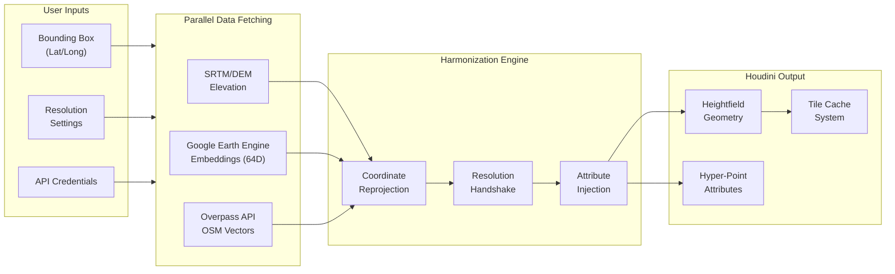
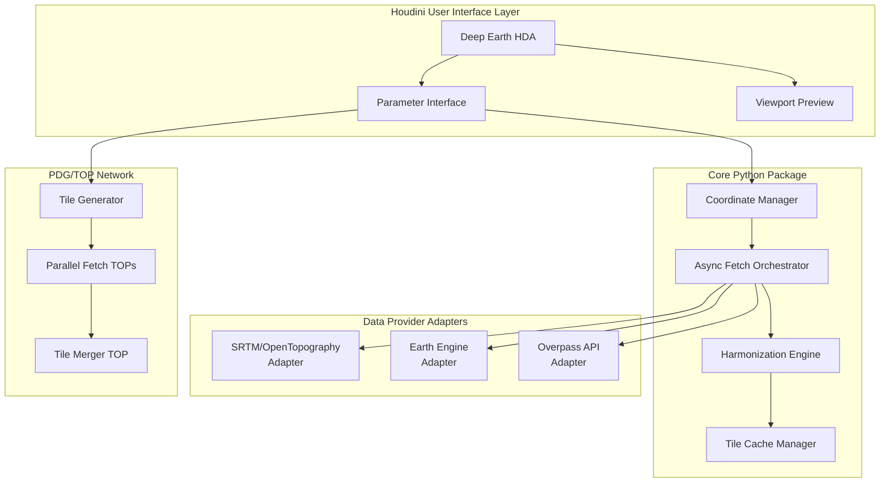
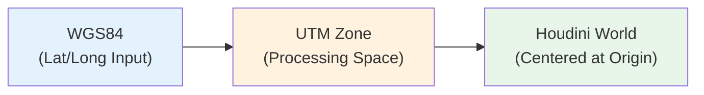
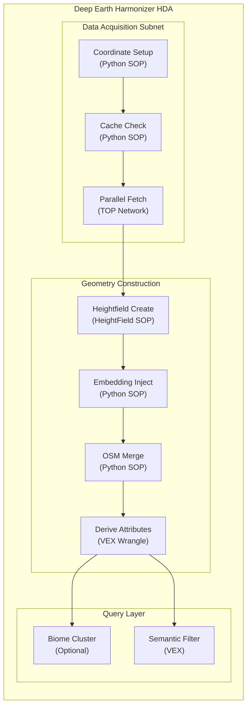
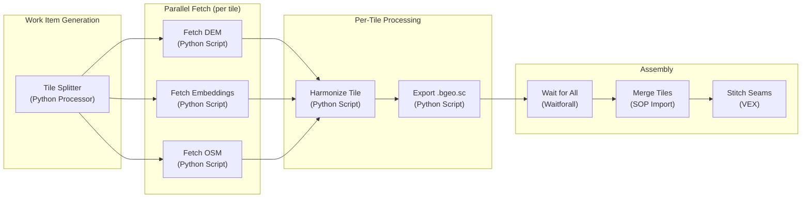

# Product Guide

## Deep Earth Harmonizer

A multi-modal geospatial data synthesizer for Houdini that constructs semantically aware terrain from satellite embeddings, elevation data, and vector infrastructure.

### Executive Summary

The **Deep Earth Harmonizer** is a Houdini tool that transforms geographic coordinates into a unified, queryable "Hyper-Point" terrain dataset. Rather than importing simple geometry, it synthesizes three distinct data streams—**geophysical** (SRTM/LiDAR elevation), **semantic** (Google Earth Engine satellite embeddings), and **vector** (OpenStreetMap infrastructure)—into a harmonized heightfield where every point carries rich attributes enabling inference-driven procedural content generation.

### Target Users
- **VFX Artists:** Creating realistic, geographically accurate environments for film and television.
- **Game Developers:** Building large-scale, semantically rich worlds with procedural placement.
- **Geospatial Analysts:** Visualizing complex multi-modal data in a 3D procedural environment.

### Core Goals
- **Unified Terrain Model:** Create a "Hyper-Point" dataset where elevation, satellite semantics, and infrastructure coexist.
- **Procedural Efficiency:** Enable inference-driven procedural generation (e.g., placing trees based on satellite embeddings).
- **Seamless Integration:** Provide a native Houdini workflow (HDA) that abstracts complex geospatial APIs.
- **Robust Data Acquisition:** Integrated retry logic with exponential backoff and centralized logging for production-grade reliability.
- **Scalability:** Handle large regions through tile-based processing and efficient caching.

### Key Features
- **Parallel Data Fetching:** Async acquisition of SRTM, GEE Embeddings, and OSM data.
- **Harmonization Engine:** Reprojection and resampling of disparate data sources into a master grid.
- **Embedding Injection:** 64-dimensional satellite embeddings stored as point or heightfield attributes.
- **OSM Rasterization:** Conversion of vector infrastructure into distance fields and semantic masks.
- **Semantic Querying:** VEX-based utilities for filtering and classifying terrain based on multi-modal data.
- **PDG Orchestration:** Parallelized tile processing for massive geographic areas.

---

# Initial Concept

# Deep Earth Harmonizer - Implementation Plan

A multi-modal geospatial data synthesizer for Houdini that constructs semantically aware terrain from satellite embeddings, elevation data, and vector infrastructure.

---

## Executive Summary

The **Deep Earth Harmonizer** is a Houdini tool that transforms geographic coordinates into a unified, queryable "Hyper-Point" terrain dataset. Rather than importing simple geometry, it synthesizes three distinct data streams—**geophysical** (SRTM/LiDAR elevation), **semantic** (Google Earth Engine satellite embeddings), and **vector** (OpenStreetMap infrastructure)—into a harmonized heightfield where every point carries rich attributes enabling inference-driven procedural content generation.



---

## I. System Architecture

### 1.1 High-Level Component Diagram



### 1.2 Architectural Principles

| Principle | Rationale |
|-----------|-----------|
| **Modular Provider System** | Each data source (SRTM, GEE, OSM) is encapsulated in an adapter class, allowing easy addition of new sources (e.g., LiDAR point clouds, Sentinel-2 imagery) |
| **Async-First Fetching** | Network I/O is the primary bottleneck; all fetches use Python `asyncio` with proper thread isolation from Houdini's main loop |
| **Tile-Based Processing** | Large regions are subdivided into manageable tiles (configurable, e.g., 1km×1km) for parallel processing and incremental caching |
| **Separation of Concerns** | Python handles data fetching and transformation; Houdini SOPs handle geometry creation and attribute binding |
| **Fail-Graceful Design** | Each data stream can fail independently without blocking others; missing data is flagged with special attribute values |

---

## II. Data Pipeline Components

### 2.1 Coordinate Manager

The Coordinate Manager is responsible for all geographic coordinate operations.

**Responsibilities:**
- Parse and validate user-provided bounding boxes (Lat/Long WGS84)
- Convert between coordinate reference systems (WGS84 ↔ UTM ↔ Web Mercator)
- Subdivide large regions into processing tiles
- Calculate tile indices and adjacency for seamless merging

**Key Dependencies:**
- `pyproj` - Coordinate transformations
- `shapely` - Geometric operations and tile subdivision

**Coordinate Space Strategy:**



> [!IMPORTANT]
> All internal processing uses **UTM (Universal Transverse Mercator)** to minimize distortion for terrain operations. The appropriate UTM zone is auto-detected from the bounding box centroid.

### 2.2 Data Provider Adapters

Each adapter implements a common interface:

```
class DataProviderAdapter:
    async def fetch(bbox: BoundingBox, resolution: float) -> ProviderResult
    def validate_credentials() -> bool
    def get_cache_key(bbox: BoundingBox, resolution: float) -> str
    def transform_to_grid(data: Any, target_grid: Grid) -> np.ndarray
```

#### 2.2.1 SRTM/Elevation Adapter

| Aspect | Details |
|--------|---------|
| **Primary Source** | OpenTopography REST API (SRTMGL1 30m, SRTMGL3 90m) |
| **Fallback Source** | AWS Open Data (SRTM 30m tiles) |
| **Output Format** | GeoTIFF → NumPy array (float32 elevation values) |
| **Resolution** | 30m native, resampled to match master grid |
| **Authentication** | OpenTopography API key (free tier available) |

**Data Flow:**
1. Calculate required SRTM tiles from bounding box
2. Check local cache for existing tiles
3. Fetch missing tiles via async HTTP
4. Mosaic tiles into continuous DEM
5. Resample to target resolution using bilinear interpolation
6. Transform to UTM coordinate space

#### 2.2.2 Google Earth Engine Embeddings Adapter

| Aspect | Details |
|--------|---------|
| **Dataset** | `projects/google/assets/experimental/embeddings/v1_satellite` |
| **Vector Dimensions** | 64 floats per pixel |
| **Native Resolution** | 10m |
| **Temporal Coverage** | Annual composites from 2017+ |
| **Authentication** | Google Cloud service account with Earth Engine API enabled |

> [!WARNING]
> **Earth Engine API Quota Considerations**
> - Computation requests are throttled per-project
> - Large exports may require batch processing via Earth Engine Tasks
> - Consider implementing exponential backoff and request queuing

**Data Flow:**
1. Initialize Earth Engine with service account credentials
2. Define `ee.Geometry.Rectangle` from bounding box
3. Select embedding Image from ImageCollection for target year
4. Clip to bounding box and reproject to UTM
5. Export to GeoTIFF (64 bands) via `ee.batch.Export.image.toDrive` or direct `getPixels`
6. Parse multi-band raster into per-pixel float[64] arrays
7. Resample to match master grid resolution

**Embedding Interpretation:**
The 64-dimensional vectors encode:
- Surface texture and reflectance patterns
- Temporal signatures (seasonal variation)
- Spatial context (learned from neighboring pixels)
- Material/landcover implicit features

#### 2.2.3 OpenStreetMap Adapter

| Aspect | Details |
|--------|---------|
| **API** | Overpass API (public instances + option for local server) |
| **Query Format** | Overpass QL |
| **Feature Types** | Nodes, Ways, Relations → Points, LineStrings, Polygons |
| **Output Format** | JSON → GeoJSON → Houdini Primitives |

**Feature Categories:**

| Category | OSM Tags | Houdini Representation |
|----------|----------|------------------------|
| Roads | `highway=*` | Polylines with `s@highway_type` |
| Waterways | `waterway=*` | Polylines/Polygons with `s@waterway_type` |
| Buildings | `building=*` | Polygons with `f@building_height`, `s@building_type` |
| Land Use | `landuse=*` | Polygons with `s@landuse_type` |
| Natural | `natural=*` | Polygons/Points with `s@natural_type` |

**Rasterization Strategy:**
For grid-aligned queries (e.g., "is this point on a road?"), vector features are rasterized to the master grid:
- Roads → Distance field (f@road_distance)
- Waterways → Distance field (f@water_distance)
- Buildings → Binary mask + height (f@building_mask, f@building_height)
- Land Use → Categorical raster (i@landuse_id)

### 2.3 Harmonization Engine

The Harmonization Engine is the "brain" that aligns all data streams into a coherent whole.

**Responsibilities:**
1. **Resolution Handshake** - Determine master grid resolution based on:
   - User preference (quality vs. performance slider)
   - Finest available source resolution
   - Houdini scene scale requirements

2. **Resampling** - All sources resampled to master grid:
   - Elevation: Bilinear interpolation (smooth terrain)
   - Embeddings: Nearest-neighbor (preserve vector integrity) or bilinear
   - OSM Rasters: Nearest-neighbor for categorical, bilinear for distance fields

3. **Coordinate Alignment** - Ensure all grids have identical:
   - Origin point (lower-left corner in UTM)
   - Cell size (meters per pixel)
   - Grid dimensions (rows × columns)

4. **Derived Attribute Computation:**

| Attribute | Computation | Type |
|-----------|-------------|------|
| `f@slope` | Gradient magnitude from DEM | float |
| `f@aspect` | Gradient direction (0-360°) | float |
| `f@curvature` | Second derivative of DEM | float |
| `f@roughness` | Local elevation variance | float |
| `f@tpi` | Topographic Position Index | float |
| `f@twi` | Topographic Wetness Index | float |

### 2.4 Tile Cache Manager

**Caching Strategy:**
```
$HOUDINI_USER_PREF_DIR/
└── deep_earth_cache/
    ├── config.json           # Cache settings, expiry policies
    ├── tiles/
    │   ├── srtm/
    │   │   └── {z}_{x}_{y}.tif
    │   ├── embeddings/
    │   │   └── {z}_{x}_{y}_{year}.tif
    │   └── osm/
    │       └── {z}_{x}_{y}_{timestamp}.json
    └── harmonized/
        └── {hash}.bgeo.sc     # Fully processed Houdini geometry cache
```

**Cache Invalidation:**
- SRTM: Never expires (static dataset)
- Embeddings: Yearly updates (cache per year)
- OSM: Configurable TTL (default 30 days), manual refresh option
- Harmonized: Invalidate when any source tile updates or parameters change

---

## III. Houdini Node Architecture

### 3.1 Node Network Overview



### 3.2 Core Node Specifications

#### 3.2.1 `deep_earth_fetch` (Python SOP)

**Purpose:** Orchestrates async data fetching and returns status/paths

**Parameters:**
| Parameter | Type | Description |
|-----------|------|-------------|
| `bbox_mode` | Menu | `Lat/Long Range`, `Center + Size`, `Draw on Map` |
| `lat_min/max` | Float | Latitude bounds (-90 to 90) |
| `long_min/max` | Float | Longitude bounds (-180 to 180) |
| `resolution` | Menu | `30m`, `10m`, `5m`, `1m` (with warnings for Earth Engine limits) |
| `year` | Integer | Year for embedding dataset (2017+) |
| `fetch_elevation` | Toggle | Enable SRTM fetch |
| `fetch_embeddings` | Toggle | Enable Earth Engine fetch |
| `fetch_osm` | Toggle | Enable OSM fetch |
| `osm_features` | Multi-Select | Roads, Buildings, Water, Land Use, etc. |
| `use_cache` | Toggle | Enable tile cache |
| `cache_path` | Directory | Override cache location |

**Output Attributes:**
| Attribute | Type | Description |
|-----------|------|-------------|
| `s@elevation_path` | Detail | Path to cached elevation GeoTIFF |
| `s@embedding_path` | Detail | Path to cached embedding GeoTIFF |
| `s@osm_path` | Detail | Path to cached OSM GeoJSON |
| `i@fetch_status` | Detail | 0=Success, 1=Partial, 2=Failed |
| `s@fetch_errors` | Detail | JSON array of error messages |

#### 3.2.2 `deep_earth_harmonize` (Python SOP)

**Purpose:** Constructs unified heightfield with all attributes

**Inputs:**
1. Fetch results (detail attributes with paths)

**Processing:**
1. Load all cached data files
2. Determine master grid from resolution settings
3. Resample all sources to master grid
4. Create Houdini heightfield primitive
5. Inject `height` layer from DEM
6. Create 64 additional heightfield layers for embeddings OR inject as point attribute
7. Rasterize and inject OSM data
8. Compute derived terrain attributes

**Key Design Decision: Embeddings Storage**

> [!NOTE]
> **Option A: Heightfield Layers** (64 named layers like `embed_00`, `embed_01`, ...)
> - Pro: Native Houdini workflow, works with existing heightfield tools
> - Con: 64 layers is unwieldy in UI, some tools may not expect this many layers
>
> **Option B: Point Attribute Array** (Convert heightfield to points, store `f[]@embedding`)
> - Pro: Clean attribute structure, easier for VEX queries
> - Con: Loses heightfield optimizations, larger memory footprint
>
> **Recommendation:** Implement **both** as user-selectable modes. Default to Option B (point-based) for semantic queries, with export option to heightfield layers for terrain operations.

#### 3.2.3 `deep_earth_query` (VEX Wrangle)

**Purpose:** Provide semantic query utilities

**Snippet Library:**

```vex
// Calculate embedding distance to reference vector
float embedding_distance(float embedding[]; float reference[]) {
    float dist = 0;
    for (int i = 0; i < 64; i++) {
        float d = embedding[i] - reference[i];
        dist += d * d;
    }
    return sqrt(dist);
}

// Classify point based on clustered biome IDs
int classify_biome(float embedding[]; int num_clusters) {
    // K-means classification against pre-computed centroids
    // Centroids stored as detail attributes
    ...
}

// Multi-modal filter: physical AND semantic AND metadata
int passes_filter(
    float elevation; float slope; 
    float embedding[]; float semantic_threshold;
    string OSM_tag; string exclude_tag
) {
    if (elevation < ch("min_elev") || elevation > ch("max_elev")) return 0;
    if (slope > ch("max_slope")) return 0;
    if (embedding_distance(embedding, detail(0, "target_embedding")) > semantic_threshold) return 0;
    if (OSM_tag == exclude_tag) return 0;
    return 1;
}
```

---

## IV. The Hyper-Point Attribute Schema

### 4.1 Complete Attribute Specification

| Attribute | Type | Source | Description |
|-----------|------|--------|-------------|
| **Spatial** | | | |
| `v@P` | vector3 | DEM | World position (UTM then Houdini-centered) |
| `v@N` | vector3 | Computed | Surface normal |
| `v@geo_coord` | vector3 | Input | Original lat/long/elevation |
| **Topological** | | | |
| `f@height` | float | DEM | Raw elevation value (meters) |
| `f@slope` | float | Computed | Slope angle in degrees |
| `f@aspect` | float | Computed | Slope direction 0-360° |
| `f@curvature` | float | Computed | Surface curvature |
| `f@roughness` | float | Computed | Local terrain roughness |
| `f@tpi` | float | Computed | Topographic Position Index |
| `f@twi` | float | Computed | Topographic Wetness Index |
| **Semantic** | | | |
| `f[]@embedding` | float[64] | GEE | Satellite embedding vector |
| `i@biome_id` | int | Computed | Cluster ID from K-Means |
| `v@biome_color` | vector3 | Computed | Visualization color per biome |
| **Infrastructure** | | | |
| `s@highway` | string | OSM | Road type if on/near road |
| `s@waterway` | string | OSM | Waterway type if applicable |
| `s@landuse` | string | OSM | Zoning/land use classification |
| `s@natural` | string | OSM | Natural feature type |
| `f@road_distance` | float | OSM | Distance to nearest road (m) |
| `f@water_distance` | float | OSM | Distance to nearest water (m) |
| `f@building_distance` | float | OSM | Distance to nearest building (m) |
| `i@in_building` | int | OSM | 1 if inside building footprint |
| `f@building_height` | float | OSM | Building height if in_building |
| **Metadata** | | | |
| `i@tile_id` | int | System | Tile index for multi-tile regions |
| `f@data_quality` | float | System | Confidence/completeness score (0-1) |
| `s@source_year` | string | GEE | Year of embedding data |

### 4.2 Attribute Access Patterns

**Direct VEX Access:**
```vex
// Read embedding for current point
float embed[] = f[]@embedding;

// Read OSM tag
string road = s@highway;

// Combined query
if (f@slope < 30 && s@landuse == "forest" && f@road_distance > 100) {
    // Suitable for tree placement
}
```

**Volume/Heightfield Layer Access:**
```vex
// Sample embedding dimension 5 at arbitrary position
float e5 = volumesample(0, "embed_05", v@P);

// Sample slope at offset position  
vector offset_pos = v@P + {10, 0, 0};
float nearby_slope = volumesample(0, "slope", offset_pos);
```

---

## V. User Interface Design

### 5.1 Parameter Interface Layout

```
┌─────────────────────────────────────────────────────────────┐
│ Deep Earth Harmonizer                                       │
├─────────────────────────────────────────────────────────────┤
│  ▼ Location                                                 │
│     Mode: [Lat/Long Range ▼]                               │
│     ┌─────────────────────────────────────────────────────┐ │
│     │  Latitude:  Min [  45.0° ] Max [  46.0° ]          │ │
│     │  Longitude: Min [ -93.0° ] Max [ -92.0° ]          │ │
│     │                                                     │ │
│     │  [🗺️ Open Map Picker]  [📍 Use Scene Center]       │ │
│     └─────────────────────────────────────────────────────┘ │
│     Estimated Size: 87 km × 111 km                         │
│                                                             │
│  ▼ Data Sources                                             │
│     ☑ Elevation (SRTM)      Resolution: [30m ▼]           │
│     ☑ Satellite Embeddings  Year: [2023 ▼]                │
│       ⚠️ Requires Earth Engine credentials                 │
│     ☑ OpenStreetMap                                        │
│       Features: ☑Roads ☑Water ☐Buildings ☑Land Use         │
│                                                             │
│  ▼ Processing                                               │
│     Master Resolution: [10m ▼]                              │
│     Coordinate System: [Auto-detect UTM ▼]                 │
│     Output Mode: [Point Cloud + Heightfield ▼]             │
│                                                             │
│  ▼ Caching                                                  │
│     ☑ Use Local Cache                                      │
│     Cache Path: [$HOUDINI_USER_PREF_DIR/deep_earth_cache]  │
│     [Clear Cache] [Refresh OSM Only]                        │
│                                                             │
│  ▼ Credentials                                              │
│     Earth Engine: [Configure...] ✓ Valid                   │
│     OpenTopography: [Configure...] ✓ Valid                 │
│                                                             │
│  ┌─────────────────────────────────────────────────────────┐ │
│  │ [       Fetch Data       ] │ [  Cancel  ] │            │ │
│  └─────────────────────────────────────────────────────────┘ │
│                                                             │
│  Status: Ready                                              │
│  ████████████░░░░░░░░░░░░░░░ 35% - Fetching embeddings...  │
└─────────────────────────────────────────────────────────────┘
```

### 5.2 Interactive Map Picker (Optional Enhancement)

For a premium UX, implement a floating Qt window with:
- Embedded map view (Leaflet.js in QWebEngineView)
- Click-to-select bounding box on map
- Preview of data coverage (outlines of available SRTM tiles)
- Estimated file sizes and fetch times

### 5.3 Viewport Visualization

**Visualization Modes:**
| Mode | Description |
|------|-------------|
| `Height` | Standard elevation coloring (low=green, high=white) |
| `Slope` | Red to yellow gradient by slope angle |
| `Embeddings PCA` | RGB from first 3 PCA components of embedding |
| `Biome Clusters` | Categorical colors per K-Means cluster |
| `OSM Overlay` | Roads (white), water (blue), buildings (gray) |
| `Data Quality` | Green (complete) to red (missing data) |

---

## VI. PDG Integration for Large Regions

### 6.1 TOP Network Architecture

For regions larger than a single tile, PDG orchestrates parallel fetching:



### 6.2 Work Item Attributes

| Attribute | Type | Description |
|-----------|------|-------------|
| `tile_x` | int | Tile column index |
| `tile_y` | int | Tile row index |
| `tile_bbox` | float[4] | Bounding box for this tile (UTM) |
| `dem_path` | file | Output path for DEM cache |
| `embed_path` | file | Output path for embeddings cache |
| `osm_path` | file | Output path for OSM cache |
| `harmonized_path` | file | Final output geometry path |

---

## VII. Error Handling & Resilience

### 7.1 Failure Modes and Recovery

| Failure Mode | Detection | Recovery | User Feedback |
|--------------|-----------|----------|---------------|
| **Network timeout** | HTTP timeout exception | Retry with exponential backoff (3 attempts) | "Retrying fetch (attempt 2/3)..." |
| **API rate limit** | 429 status code | Wait and retry with backoff | "Rate limited, waiting 60s..." |
| **Invalid credentials** | 401/403 status | Skip source, flag in output | "⚠️ Earth Engine auth failed - embeddings unavailable" |
| **Partial data** | Missing tiles in response | Use available tiles, mark gaps | `f@data_quality = 0` for missing areas |
| **Corrupt cache** | File read exception | Delete cache, re-fetch | "Cache corrupted, re-fetching..." |
| **Out of bounds** | Empty response | Warn user, continue | "⚠️ No OSM data in this region" |

### 7.2 Data Quality Tracking

Every point carries `f@data_quality`:
- `1.0` = All sources present and valid
- `0.75` = Missing OSM data
- `0.5` = Missing embeddings
- `0.25` = Elevation only
- `0.0` = Interpolated (no direct data)

---

## VIII. Performance Optimization

### 8.1 Memory Management

| Strategy | Implementation |
|----------|----------------|
| **Lazy loading** | Don't load full 64-band embedding raster until needed |
| **Tile streaming** | Process tiles sequentially for very large regions |
| **LOD pyramids** | Pre-compute multi-resolution versions of heightfield |
| **Compressed cache** | Use `.bgeo.sc` (Blosc compression) for geometry cache |
| **Attribute culling** | Option to drop unused attributes before export |

### 8.2 Expected Performance Benchmarks

| Region Size | Resolution | Points | Estimated Fetch | Estimated Process | Total Memory |
|-------------|------------|--------|-----------------|-------------------|--------------|
| 1 km² | 10m | 10K | 5-10s | 2s | 50 MB |
| 10 km² | 10m | 100K | 30-60s | 10s | 500 MB |
| 100 km² | 10m | 1M | 2-5 min | 60s | 5 GB |
| 100 km² | 30m | 111K | 1-2 min | 15s | 600 MB |

> [!CAUTION]
> **Large Region Warning**
> Regions > 50 km² at < 10m resolution will require:
> - PDG tile-based processing
> - Significant disk cache space (10+ GB)
> - Earth Engine export tasks (async, may take minutes)
> Consider implementing a "preview mode" at lower resolution first.

---

## IX. Credential & Configuration Management

### 9.1 Credential Storage

**Location:** `$HOUDINI_USER_PREF_DIR/deep_earth/credentials.json`

```json
{
  "earth_engine": {
    "service_account": "my-project@appspot.gserviceaccount.com",
    "key_file": "/path/to/service-account-key.json"
  },
  "opentopography": {
    "api_key": "xxxxxxxxxxxxxxxxxxxxxxxxxxxxxxxx"
  }
}
```

> [!IMPORTANT]
> Credentials file should have restricted permissions (chmod 600) and should **never** be committed to version control.

### 9.2 First-Run Setup Wizard

On first use, present a guided setup:
1. Earth Engine authentication flow
2. OpenTopography API key entry (with link to registration)
3. Cache location selection
4. Test connection to all services

---

## X. Verification Plan

### 10.1 Automated Tests

| Test Category | Test Cases |
|---------------|------------|
| **Coordinate Manager** | UTM zone detection, tile subdivision, edge cases at antimeridian |
| **Provider Adapters** | Mock API responses, error injection, cache hit/miss |
| **Harmonization** | Grid alignment verification, resampling accuracy |
| **Attribute Schema** | All attributes populated, correct types |
| **VEX Snippets** | Embedding distance calculation, filter logic |

### 10.2 Integration Test Workflow

1. **Test Region:** Minneapolis downtown (well-mapped OSM, diverse terrain)
2. **Bounding Box:** `44.97, -93.28` to `44.99, -93.25` (~2 km²)
3. **Verification Steps:**
   - [ ] Elevation matches USGS reference values (±5m)
   - [ ] Embedding vectors have valid ranges (no NaN/Inf)
   - [ ] OSM roads visible and correctly positioned
   - [ ] Derived attributes (slope, aspect) physically plausible
   - [ ] Cache invalidation works correctly
   - [ ] Error handling for invalid credentials

### 10.3 Visual Verification

- Compare viewport render to Google Earth satellite view
- Overlay OSM road geometry on satellite imagery
- Verify biome clustering produces visually distinct regions

---

## XI. Implementation Roadmap

### Phase 1: Foundation (Week 1-2)
- [ ] Python package structure and dependencies
- [ ] Credential management system
- [ ] Coordinate Manager implementation
- [ ] Basic HDA shell with parameter interface

### Phase 2: Data Providers (Week 3-4)
- [x] SRTM/OpenTopography adapter (with caching)
- [x] Earth Engine adapter (with async export handling)
- [x] Overpass API adapter (with rasterization)
- [x] Unit tests for each provider

### Phase 3: Harmonization (Week 5-6)
- [ ] Grid resampling and alignment
- [ ] Derived attribute computation
- [ ] Heightfield/point cloud generation
- [ ] Attribute injection pipeline

### Phase 4: Houdini Integration (Week 7-8)
- [ ] Complete HDA with all parameters
- [ ] VEX snippet library
- [ ] Viewport visualization modes
- [ ] Cache management UI

### Phase 5: PDG & Scale (Week 9-10)
- [ ] TOP network for tile-based processing
- [ ] Large region handling
- [ ] Performance optimization
- [ ] Memory management

### Phase 6: Polish & Documentation (Week 11-12)
- [ ] First-run setup wizard
- [ ] Error handling refinement
- [ ] User documentation
- [ ] Example scenes and tutorials

---

## XII. Confirmed Design Decisions

> [!NOTE]
> **Finalized Architecture Choices** (Approved 2024-12-28)

| Decision | Choice | Rationale |
|----------|--------|-----------|
| **Embedding Storage** | Point attribute array (`f[]@embedding`) with export option to heightfield layers | Cleaner attribute structure for VEX queries; heightfield layers available on-demand for terrain ops |
| **K-Means Clustering** | Separate downstream node (`deep_earth_cluster`) | Keeps core harmonizer focused; allows different clustering configs without re-fetching data |
| **OSM Features (Default)** | Roads, Waterways, Land Use, Natural | Buildings off by default (high polygon count for large regions); easily toggleable |
| **Credential Flow** | Separate "Deep Earth Credentials" HDA/panel | Reusable across multiple harmonizer instances; cleaner UX for studios |
| **Target Houdini** | 19.5+ (Python 3.9+, modern asyncio support) | Best async/await support; modern PDG features; still widely deployed |
| **Distribution** | Standalone Python package + HDA wrapper | Allows pip-based dependency management; easier testing; HDA imports package |

---

## Appendix A: External Dependencies

| Package | Version | Purpose | License |
|---------|---------|---------|---------|
| `earthengine-api` | ≥0.1.370 | Google Earth Engine access | Apache 2.0 |
| `pyproj` | ≥3.4 | Coordinate transformations | MIT |
| `shapely` | ≥2.0 | Geometric operations | BSD |
| `rasterio` | ≥1.3 | GeoTIFF reading/writing | BSD |
| `numpy` | ≥1.24 | Array operations | BSD |
| `aiohttp` | ≥3.8 | Async HTTP client | Apache 2.0 |
| `scikit-learn` | ≥1.2 | K-Means clustering | BSD |
| `osmtogeojson` | ≥0.1 | OSM to GeoJSON conversion | MIT |

## Appendix B: File Structure

```
$HOUDINI_USER_PREF_DIR/packages/deep_earth/
├── deep_earth.json                # Houdini package descriptor
├── otls/
│   └── deep_earth_harmonizer.hda  # Main HDA
├── python/
│   └── deep_earth/
│       ├── __init__.py
│       ├── config.py              # Settings management
│       ├── credentials.py         # Credential handling
│       ├── coordinates.py         # Coordinate Manager
│       ├── cache.py               # Tile Cache Manager
│       ├── harmonize.py           # Harmonization Engine
│       ├── providers/
│       │   ├── __init__.py
│       │   ├── base.py            # Abstract adapter
│       │   ├── srtm.py            # SRTM adapter
│       │   ├── earth_engine.py    # GEE adapter
│       │   └── osm.py             # Overpass adapter
│       └── houdini/
│           ├── __init__.py
│           ├── geometry.py        # Heightfield/point ops
│           └── vex_snippets.py    # VEX code generation
├── scripts/
│   └── deep_earth_setup.py        # First-run wizard
└── help/
    └── nodes/sop/deep_earth_harmonizer.txt
```